# Módulo 10: Manejo de errores
## Tracebacks

Primer intento de abrir mars.jpg
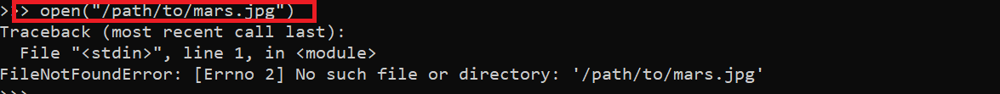

Se definió el archivo _open.py_:
```python
def main():
    open("/path/to/mars.jpg")

if __name__ == '__main__':
    main()
```
Que al ser ejecutado:

¡Da error!

---
## Controlando las exepciones 
### Try y Except de los bloques
Se define el bloque try-except y se prueba
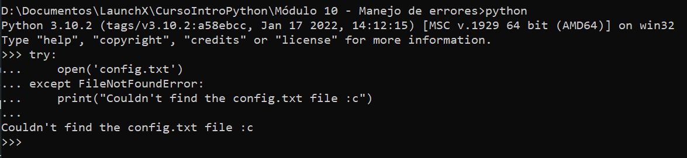

Ahora mejor se define la función en _config.py_
```python
def main():
    try:
        configuration = open('config.txt')
    except FileNotFoundError:
        print("Couldn't find the config.txt file!")


if __name__ == '__main__':
    main()
```
Que se ejecuta así:

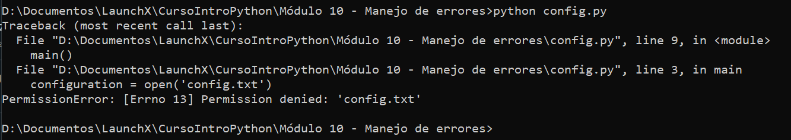

Generalizando la excepción con `Exception`:
```python
def main():
    try:
        configuration = open('config.txt')
    except Exception:
        print("Couldn't find the config.txt file!")
```
Que resulta en:

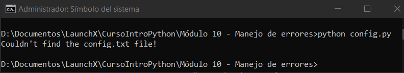

Incluyendo `FileNotFoundError` y `PermissionError` a la función anterior(siendo el 2do el error que estoy obteniendo yo)
```python
def main():
    try:
        configuration = open('config.txt')
    except FileNotFoundError:
        print("Couldn't find the config.txt file!")
    except IsADirectoryError:
        print("Found config.txt but it is a directory, couldn't read it")
    except PermissionError:
        print("Permission not granted for the file")
```

Y como resultado:

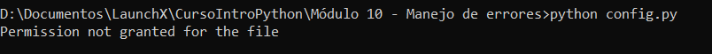

Ahora eliminaremos el directorio config.txt y volviendo a ejecutar el programa _config.py_

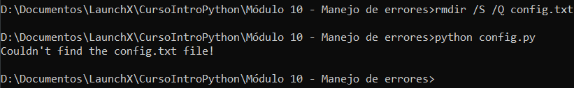

Marte:
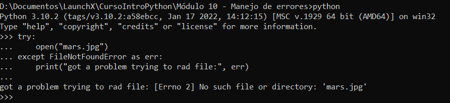

Uso de errno
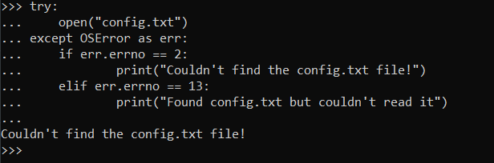

---
## Generación de excepciones
Agua restante v1:
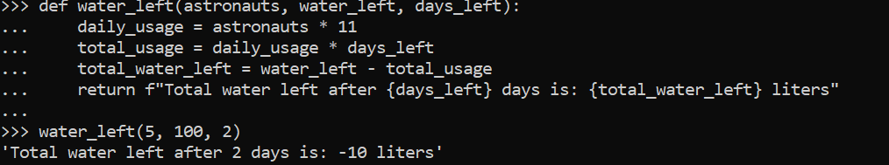

Alzando una excepción
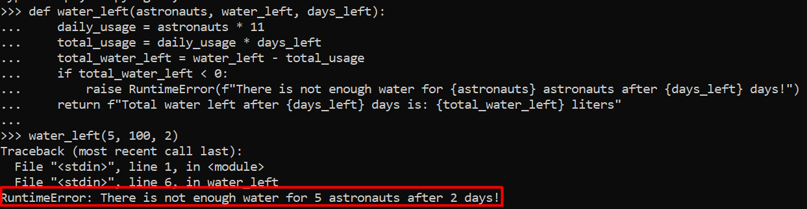

Implementando un módulo de alerta
```python
try:
    water_left(5, 100, 2)
except RuntimeError as err:
    alert_navigation_system(err)
```
La función `alert_navigation_system` solamente imprime el error.

Si se hace la llamada con tipos no esperados se obtiene:

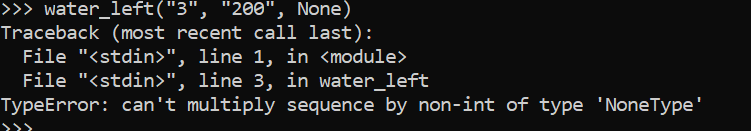

Modificando la función para evitar tipos no admitidos
```python
def water_left(astronauts, water_left, days_left):
    for argument in [astronauts, water_left, days_left]:
        try:
            # If argument is an int, the following operation will work
            argument / 10
        except TypeError:
            # TypError will be raised only if it isn't the right type 
            # Raise the same exception but with a better error message
            raise TypeError(f"All arguments must be of type int, but received: '{argument}'")
    daily_usage = astronauts * 11
    total_usage = daily_usage * days_left
    total_water_left = water_left - total_usage
    if total_water_left < 0:
        raise RuntimeError(f"There is not enough water for {astronauts} astronauts after {days_left} days!")
    return f"Total water left after {days_left} days is: {total_water_left} liters"
```
Se obtiene un mucho mejor error
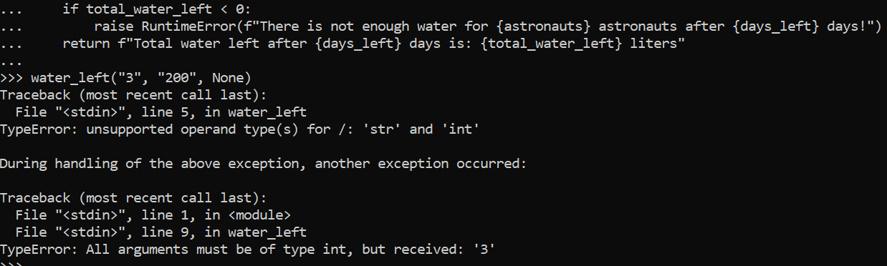

---
## Fin de la kata :)

